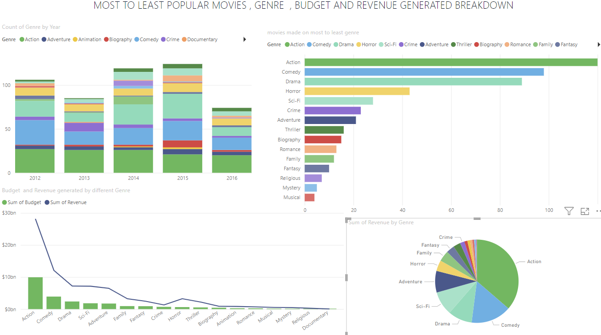

# Movies project
## Description 
The dataset used for this project is the movies dataset which shows the genres on which movies are made on yearly basis ,the movie genres , the most popular genere and the number of movies each genre have, the budget and the revenue generated by the genres. The dataset used was downloaded form kaggle.

## Environment Used
Power Bi Desktop

## Process
- First the data was cleaned using excel then was loaded into power bi for the visualization.
- Then the visualizations were made the first visualization shows the count of genre on yearly basis.
- The second visualization shows the genres in which movies are made from most to least.
- The third visualization shows budget and revenue generated by different genres.
- The last visualization shows the sum of revenue generated by each genre.

## Final Dashboard

